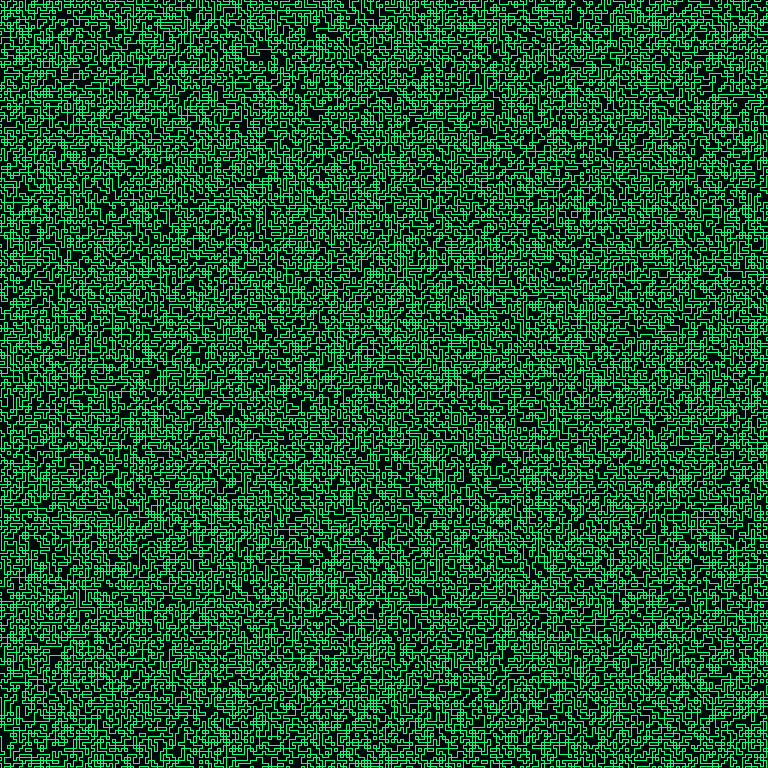

The goal of this project was to learn how to generate images using wavefunction collapse.
It was built completely from scratch with no prior knowledge of how wavefunction collapse works or how to efficiently implement it.
There will be updates in the future to add support for desired features including gradient color options, differently-sized tiles, image insertions, and dynamic tile generation.
Additionally, many performance enhancements are planned before this project reaches its final state.

So far, the generator allows the user to specify two colors, then it will then generate continuous patterns using those two colors.
One example of such a generation is the following:

The original wavefunction collapse can be found [here](https://github.com/mxgmn/WaveFunctionCollapse). It is much more sophisticated than this implementation because this is an early alpha version of this library. The libraries are intended to differ fundamentally at a later date.