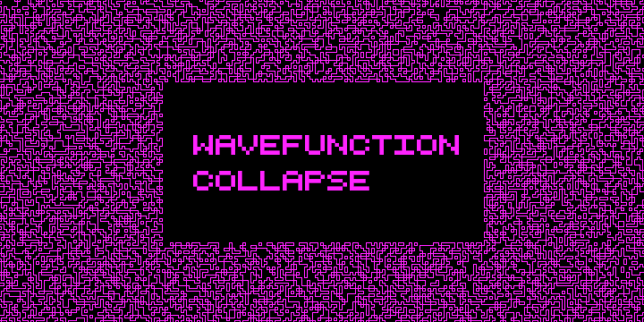

The goal of this project was to learn how to generate images using wavefunction collapse.
It was built completely from scratch with no prior knowledge of how wavefunction collapse works or how to efficiently implement it.
There will be updates in the future to add support for desired features including gradient color options, image insertions, and dynamic tile generation.
Additionally, many performance enhancements are planned before this project reaches its final state.

So far, the generator allows the user to specify two colors, then it will then generate continuous patterns using those two colors.
One example of such a generation is the following:

There is currently one method that should be used for image generation. In the wavefunction_collapse.py file, the method is wavefunction_collapse(tiles=None, tileset=None, x_dim=None, y_dim=None, dark=None, light=None). The parameters are as follows:
- tiles: a 2D list of the tiles of a given image. If none is given, then an empty image is generated
- tileset: a list of the desired tiles used for image generation
- x_dim: the x dimensions of the desried output (measured in tiles). If none are given, the default x dimension (256 tiles) is used.
- y_dim: the y dimensions of the desired output (measured in tiles). If none are given, the default y dimension (256 tiles) is used.
- dark: a tuple of length 3 containing the rgb values of the desired negative space color. If none are given, the default color (black) is used.
- light: a tuple of length 3 containing the rgb values of the desired line color. If none are given, the default color (black) is used.

Internally, each tile is stored as a 2D list of 0's and 1's. In the output, a 1 is converted into a 'light' pixel and a 0 is converted into a 'dark' pixel.
 
The original wavefunction collapse can be found [here](https://github.com/mxgmn/WaveFunctionCollapse). It is much more sophisticated than this implementation because this is an early alpha version of this library. The libraries are intended to differ fundamentally at a later date.
